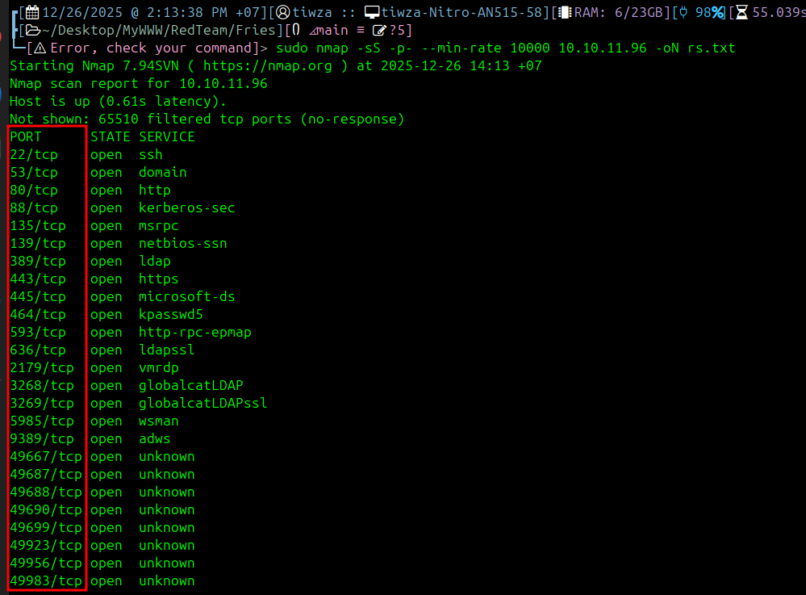
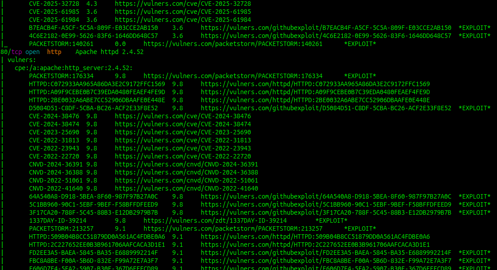
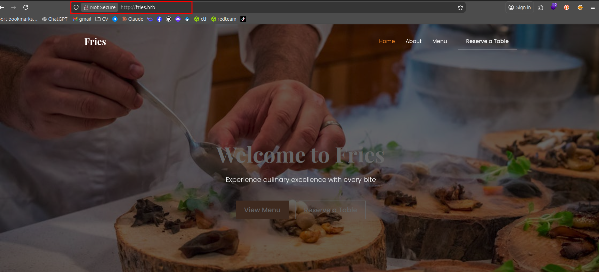
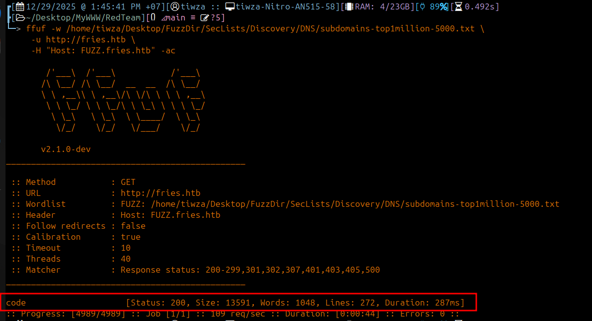
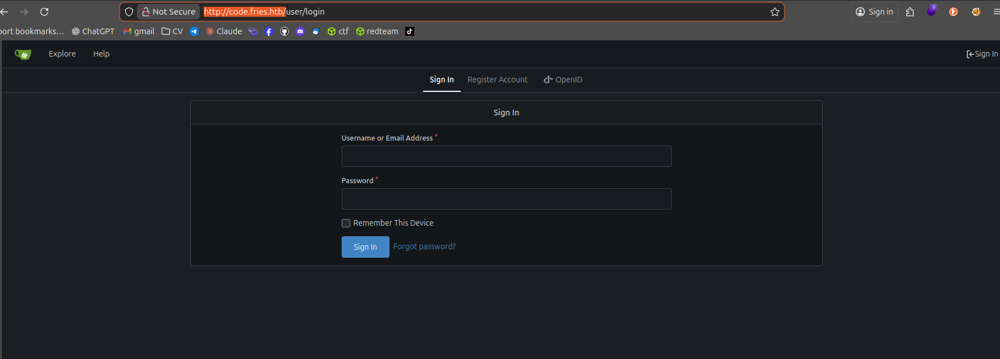

# Port scanning 

- Scan port như thường lệ , ta có được 22 , 80  


```c
nmap -p- -sC -sV  10.10.11.97
```

- Cổng 80 là web r 


- Scan subdomain 


- Mở ra ta sẽ thấy giao diện khác `http://code.fries.htb`


- Theo đề bài cung cấp ta sẽ đăng nhập với `d.cooper@fries.htb / D4LE11maan!!`

- 